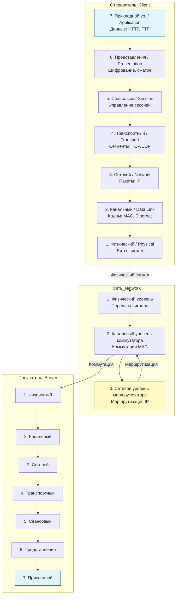
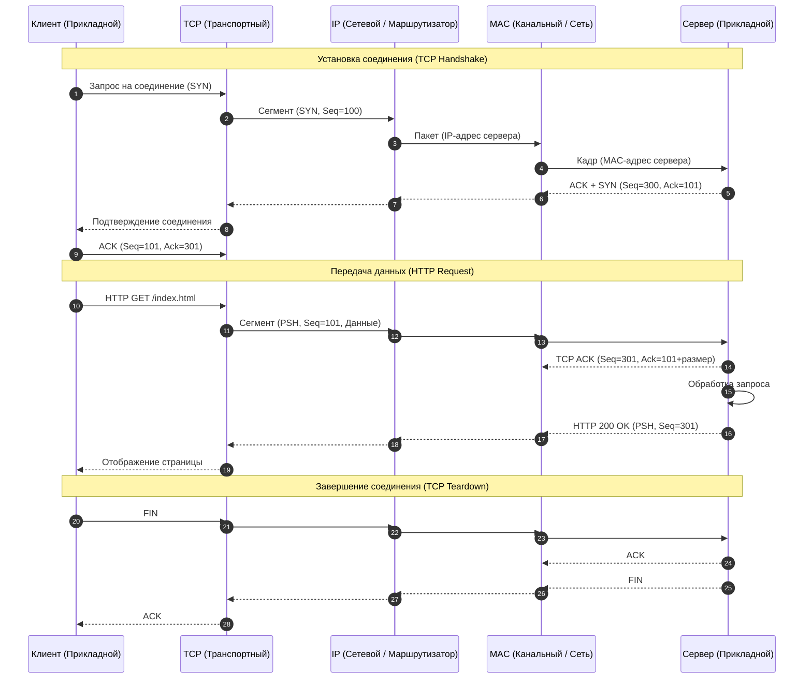
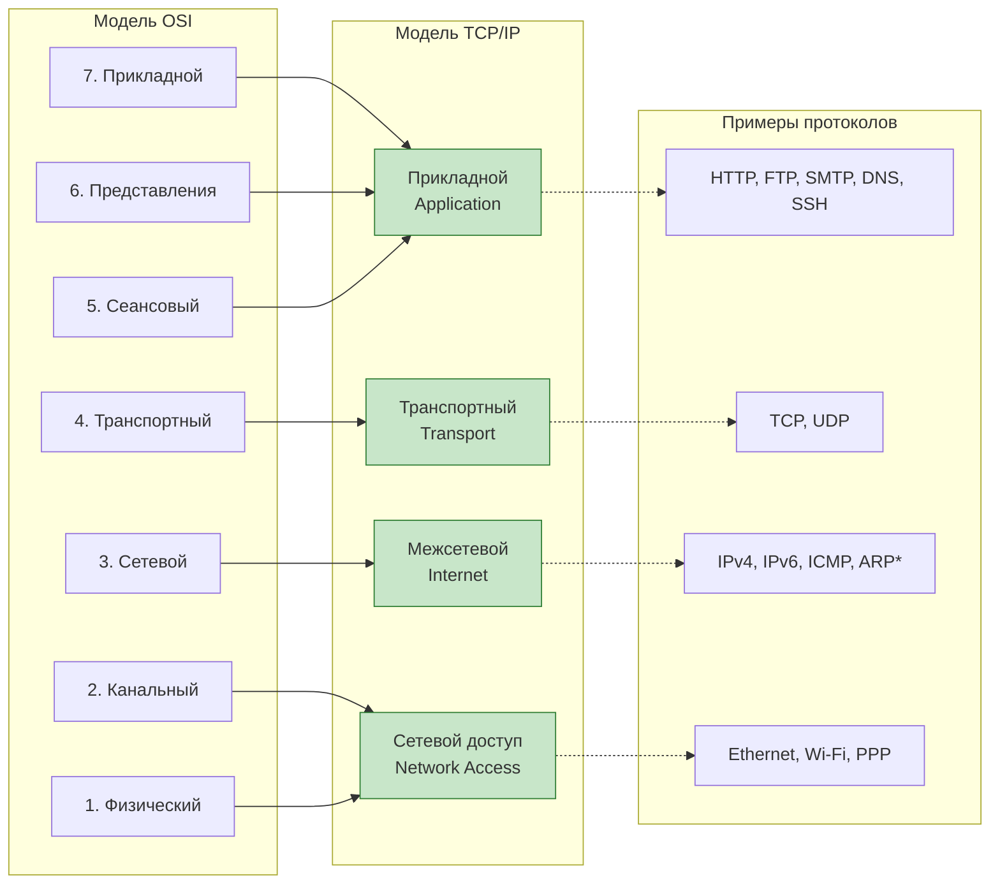

---

### Диаграмма развертывания (Deployment Diagram)
Диаграмма показывает, как уровни моделей соотносятся друг с другом и с физическими узлами (отправитель, маршрутизатор, получатель) в концепции инкапсуляции.

**Описание развертывания:**
1.  **Инкапсуляция (Слева):** На стороне клиента данные проходят сверху вниз. Каждый уровень добавляет свой заголовок (PDU).
2.  **Транзитные узлы (Середина):**
    *   Маршрутизатор работает преимущественно на **Сетевом уровне (L3)**. Он снимает канальный уровень (L2), анализирует IP-пакет, определяет следующий хоп, заново инкапсулирует в новый кадр (L2) и отправляет.
    *   Коммутатор работает на **Канальном уровне (L2)**, коммутируя кадры на основе MAC-адресов.
3.  **Деинкапсуляция (Справа):** На сервере данные движутся снизу вверх. Заголовки последовательно снимаются, пока данные не будут переданы в приложение.

---

---

### Диаграмма последовательности — Модель TCP/IP (Стек протоколов)
Модель TCP/IP является более "плоской" и практичной. Она объединяет верхние три уровня OSI (5,6,7) в один **Прикладной (Application)**. В этом примере показана типичная передача HTTP-запроса с установкой TCP-соединения (3-way handshake) и его завершением.

**Пояснение к последовательности:**
1.  **Установка связи:** В модели TCP/IP передача данных невозможна без предварительного логического соединения на транспортном уровне (кроме UDP). Это знаменитое "рукопожатие" (SYN, SYN-ACK, ACK).
2.  **Передача:** Прикладной уровень (HTTP) отдает данные транспортному (TCP). TCP разбивает данные на сегменты, нумерует их и отправляет. Сетевой уровень (IP) заботится о маршрутизации, канальный (MAC) — о доставке в пределах локального сегмента.
3.  **Завершение:** Четырехэтапное завершение соединения (FIN, ACK, FIN, ACK).

---

### Детальный разбор соответствия уровней (Сравнительная диаграмма)

Эта диаграмма наглядно показывает, как уровни OSI отображаются на стек TCP/IP и какие протоколы на них работают.

**Ключевые различия, отраженные в диаграммах:**
1.  **Уровни 5-7 OSI:** В стеке TCP/IP они объединены в один "Прикладной уровень". На практике разработчики не разделяют сеансовый уровень и уровень представления внутри кода приложений; эти функции (например, шифрование TLS) реализуются библиотеками, но логически находятся над транспортным уровнем.
2.  **Уровни 1-2 OSI:** В модели TCP/IP объединены в "уровень сетевого доступа" (Network Access), так как TCP/IP не специфицирует физическую среду передачи (медь, оптика, радио), но требует наличия интерфейса для передачи IP-пакетов через канальный уровень.
3.  **Роль ARP (Address Resolution Protocol):** Хотя технически ARP работает на канальном уровне, в диаграммах его часто помещают на границе между сетевым и канальным уровнем, так как он преобразует IP (L3) в MAC (L2).

### Заключение
*   **Модель OSI** является теоретическим эталоном. Она хороша для описания *взаимодействия уровней* (диаграмма последовательности №2) и разделения ответственности.
*   **Модель TCP/IP** является практической реализацией. Диаграмма развертывания показывает, что в реальных сетях маршрутизаторы "поднимаются" только до 3-го уровня (IP), а коммутаторы — до 2-го (MAC), что соответствует структуре TCP/IP.

Если вам нужно уточнить детали по конкретному протоколу (TCP, IP, HTTP) или построить более сложную схему (например, с NAT или VLAN), дайте знать, я дополню разбор.