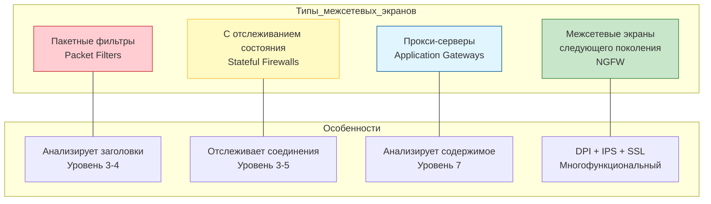
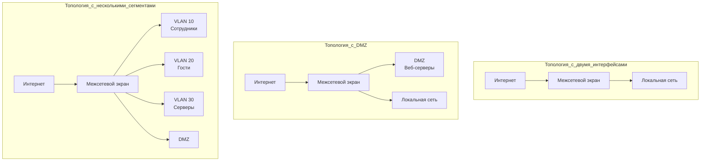
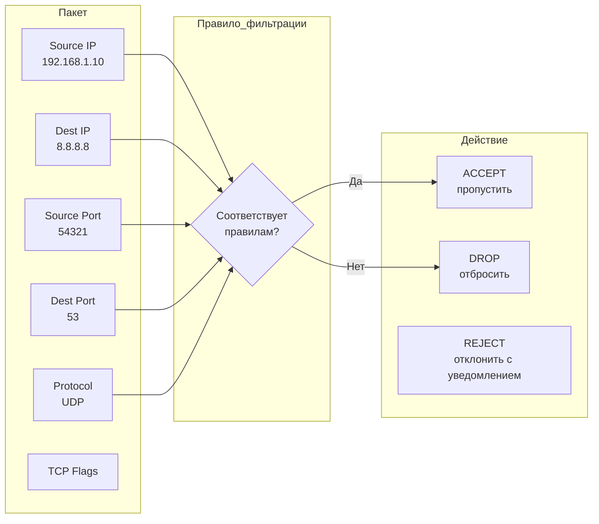

# Модуль 5. Сервисы фильтрации пакетов и трансляции адресов

## Введение: Зачем нужна фильтрация и трансляция?

Представьте, что вы охраняете вход в здание:
- **Фильтрация** — вы проверяете, кто входит (разрешенные сотрудники) и что они несут (безопасность).
- **NAT** — вы меняете "пропуска" так, чтобы внешний мир видел только один вход, а внутри было много людей (хосты) с разными кабинетами.

**Межсетевой экран (Firewall)** — это система безопасности, контролирующая трафик между сетями.
**NAT (Network Address Translation)** — механизм преобразования IP-адресов, позволяющий экономить адресное пространство и скрывать внутреннюю структуру сети.

---

## Часть 1. Обзор типов межсетевых экранов

### 1.1 Классификация по архитектуре



### 1.2 Сравнение типов межсетевых экранов

| Тип | Уровень OSI | Принцип работы | Преимущества | Недостатки |
|-----|-------------|----------------|--------------|------------|
| **Пакетный фильтр** | 3-4 | Проверяет заголовки IP, TCP, UDP | Быстрый, простой | Не анализирует контекст |
| **Stateful** | 3-5 | Отслеживает состояние соединений | Безопаснее, понимает контекст | Ресурсоемкость |
| **Прокси** | 7 | Посредник для приложений | Глубокий анализ контента | Медленный, сложный |
| **NGFW** | 2-7 | DPI, IPS, приложения | Максимальная защита | Дорогой, сложный |

### 1.3 Топологии развертывания



---

## Часть 2. Принципы работы пакетных фильтров

### 2.1 Базовый принцип

**Пакетный фильтр** анализирует каждый пакет изолированно, без учета контекста предыдущих пакетов.



### 2.2 Структура правил фильтрации

Типичное правило пакетного фильтра состоит из:

```
[Действие] [Протокол] [Source IP] [Source Port] [Destination IP] [Destination Port] [Flags]
```

**Примеры правил (iptables):**

```bash
# Разрешить SSH только с конкретного IP
iptables -A INPUT -p tcp --dport 22 -s 192.168.1.100 -j ACCEPT

# Разрешить HTTP всем
iptables -A INPUT -p tcp --dport 80 -j ACCEPT

# Запретить все остальное
iptables -A INPUT -j DROP
```
