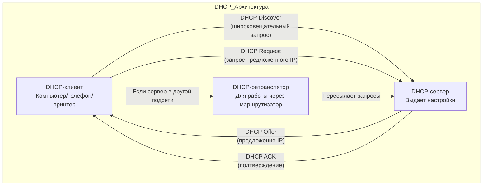
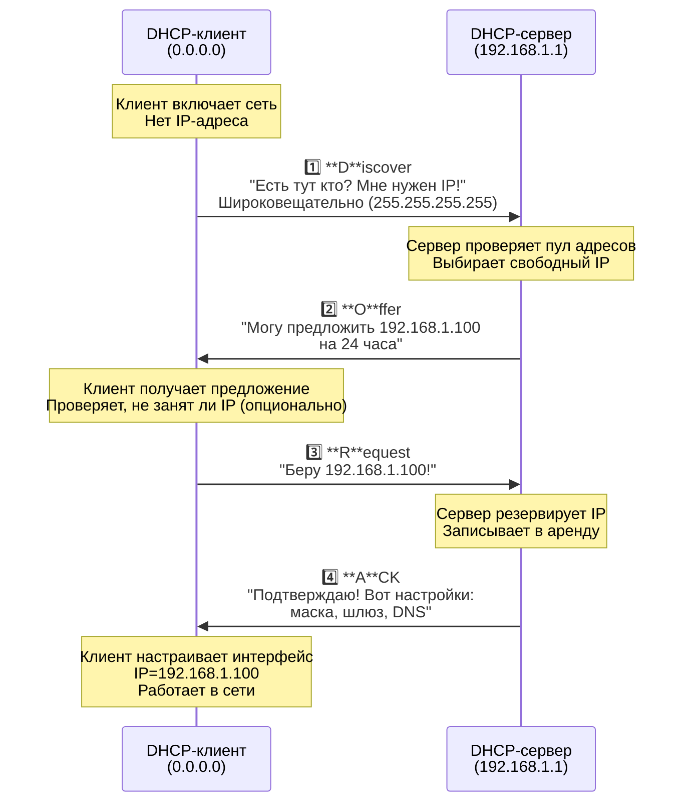
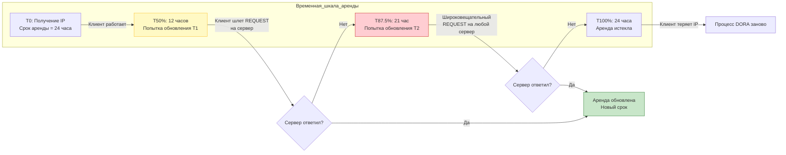
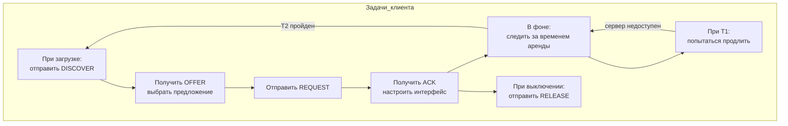
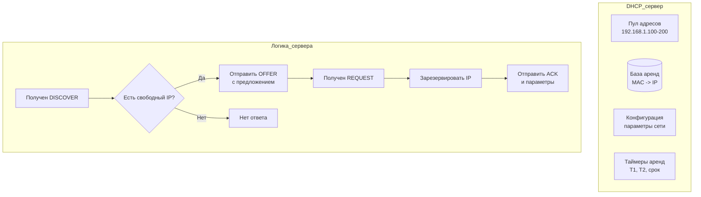
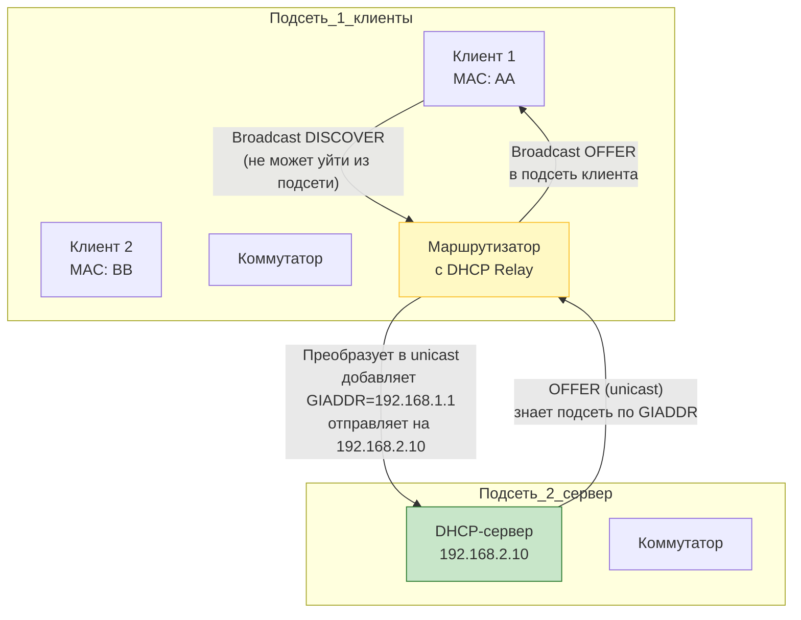
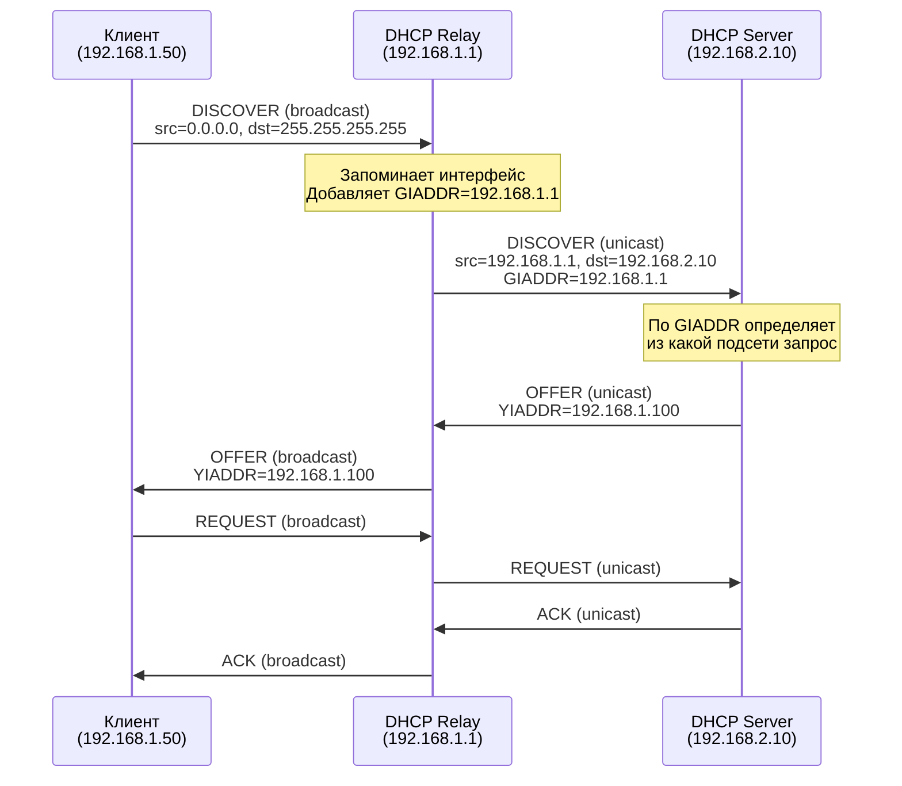
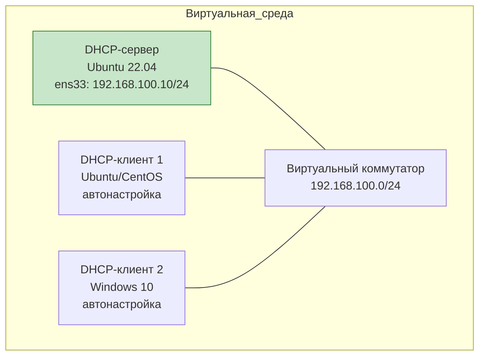

# Полный разбор работы DHCP-сервера

## Введение: Зачем нужен DHCP?

Представьте, что вы заселяетесь в гостиницу. Вместо того чтобы заполнять 10 форм вручную (имя, номер паспорта, адрес, номер комнаты, ключи...), вы просто показываете паспорт на ресепшене, и вам выдают готовый ключ с номером комнаты.

**DHCP (Dynamic Host Configuration Protocol)** — это "ресепшен" в мире компьютерных сетей. Он автоматически выдает устройствам:
- IP-адрес
- Маску подсети
- Шлюз по умолчанию (gateway)
- DNS-серверы
- Другие параметры

Без DHCP администратору пришлось бы вручную настраивать каждый компьютер, телефон, принтер в сети.

---

## Часть 1. Принципы работы протокола DHCP

### 1.1 Базовая архитектура



### 1.2 DORA — 4 шага получения IP-адреса

DHCP использует процесс, который легко запомнить по аббревиатуре **DORA**:



### 1.3 Форматы DHCP-пакетов

```mermaid
graph TD
    subgraph DHCP_пакет
        OP[OP: 1=запрос, 2=ответ]
        HTYPE[HTYPE: тип оборудования<br/>1=Ethernet]
        HLEN[HLEN: длина MAC-адреса<br/>6 байт]
        XID[XID: транзакция<br/>уникальный ID]
        CIADDR[CIADDR: текущий IP клиента<br/>(0.0.0.0 если нет)]
        YIADDR[YIADDR: предлагаемый IP<br/>(Offer/ACK)]
        SIADDR[SIADDR: IP сервера]
        GIADDR[GIADDR: IP ретранслятора<br/>(relay agent)]
        CHADDR[CHADDR: MAC-адрес клиента<br/>уникальный идентификатор]
        OPTIONS[OPTIONS: дополнительные параметры<br/>маска, шлюз, DNS, ...]
    end
```

### 1.4 Жизненный цикл аренды (Lease)



---

## Часть 2. Компоненты DHCP

### 2.1 DHCP-клиент

**Кто это?** Любое устройство, которое получает IP-адрес автоматически.

**Где живет?**
- **Linux:** `dhclient`, `dhcpcd`, или встроенный в systemd-networkd
- **Windows:** Служба DHCP Client
- **Android/iOS:** Встроенный DHCP-клиент

**Что делает?**


### 2.2 DHCP-сервер

**Кто это?** Служба, которая управляет пулом IP-адресов и выдает их клиентам.

**Основные компоненты:**



### 2.3 DHCP-ретранслятор (DHCP Relay)

**Проблема:** DHCP использует широковещательные (broadcast) пакеты. А broadcast не проходит через маршрутизаторы.

**Решение:** DHCP Relay Agent (также называемый DHCP Helper)



**Как работает Relay:**



---

## Часть 3. Лабораторная работа: ISC DHCP Server

### 3.1 Лабораторная среда

**Цель:** Установить, настроить и проверить работу DHCP-сервера.

**Схема лабораторной работы:**



### 3.2 Установка DHCP-сервера

#### Шаг 1: Установка пакета

```bash
# Обновляем список пакетов
sudo apt update

# Устанавливаем ISC DHCP Server
sudo apt install isc-dhcp-server -y

# Проверяем, что служба установлена
systemctl status isc-dhcp-server
```

**Что установилось:**
- `/etc/dhcp/dhcpd.conf` — основной файл конфигурации
- `/etc/default/isc-dhcp-server` — файл с настройками интерфейсов
- `/var/lib/dhcp/dhcpd.leases` — файл с активными арендами

#### Шаг 2: Настройка интерфейса для DHCP-сервера

```bash
# Редактируем /etc/default/isc-dhcp-server
sudo nano /etc/default/isc-dhcp-server

# Находим и редактируем строку:
INTERFACESv4="ens33"
INTERFACESv6=""
```

### 3.3 Базовая конфигурация DHCP-сервера

#### Шаг 3: Редактирование dhcpd.conf

```bash
sudo nano /etc/dhcp/dhcpd.conf
```

**Базовая конфигурация (убираем комментарии и добавляем):**

```bash
# Глобальные настройки
option domain-name "lab.local";
option domain-name-servers 8.8.8.8, 8.8.4.4;

# Время аренды по умолчанию (в секундах)
default-lease-time 86400;    # 24 часа
max-lease-time 604800;        # 7 дней

# Авторитетный режим (сервер - единственный в сети)
authoritative;

# Логирование
log-facility local7;

# Определяем подсеть
subnet 192.168.100.0 netmask 255.255.255.0 {
    # Пул адресов для динамической выдачи
    range 192.168.100.100 192.168.100.200;
    
    # Шлюз по умолчанию
    option routers 192.168.100.1;
    
    # DNS-серверы (можно переопределить)
    option domain-name-servers 8.8.8.8, 8.8.4.4;
    
    # Доменное имя
    option domain-name "lab.local";
    
    # Broadcast-адрес
    option broadcast-address 192.168.100.255;
    
    # Время аренды для этой подсети
    default-lease-time 86400;
    max-lease-time 604800;
}
```

#### Шаг 4: Статические резервирования (фиксированные IP)

```bash
# Добавляем в конфигурацию после определения подсети

# Резервирование по MAC-адресу
host printer-hp {
    hardware ethernet 00:1A:2B:3C:4D:5E;
    fixed-address 192.168.100.50;
    option host-name "hp-printer";
}

host server-web {
    hardware ethernet AA:BB:CC:DD:EE:FF;
    fixed-address 192.168.100.10;
    option host-name "web-server";
}

# Можно добавить опциональные параметры
host special-client {
    hardware ethernet 11:22:33:44:55:66;
    fixed-address 192.168.100.99;
    option routers 192.168.100.254;  # Другой шлюз для этого клиента
    option domain-name-servers 10.0.0.1;
}
```

### 3.4 Проверка конфигурации и запуск

#### Шаг 5: Проверка синтаксиса

```bash
# Проверяем конфигурацию на ошибки
sudo dhcpd -t

# Если конфигурация верна, увидим:
# Configuration file syntax check succeeded
```

#### Шаг 6: Запуск службы

```bash
# Запускаем DHCP-сервер
sudo systemctl start isc-dhcp-server

# Включаем автозапуск
sudo systemctl enable isc-dhcp-server

# Проверяем статус
sudo systemctl status isc-dhcp-server
```

#### Шаг 7: Проверка логов

```bash
# Логи DHCP попадают в syslog
sudo tail -f /var/log/syslog | grep dhcpd

# Или смотрим journalctl
sudo journalctl -u isc-dhcp-server -f
```

### 3.5 Настройка клиента для получения IP

#### Linux-клиент (dhclient)

```bash
# На клиенте: получаем IP через DHCP
sudo dhclient -v ens33

# Проверяем полученный IP
ip addr show ens33

# Проверяем маршруты
ip route show

# Смотрим DNS
cat /etc/resolv.conf

# Освободить IP
sudo dhclient -r ens33
```


### 3.6 Мониторинг и управление

#### Просмотр активных аренд

```bash
# Смотрим файл аренд
sudo cat /var/lib/dhcp/dhcpd.leases

# Пример содержимого:
# lease 192.168.100.100 {
#   starts 4 2024/03/24 10:15:30;
#   ends 5 2024/03/25 10:15:30;
#   tstp 5 2024/03/25 10:15:30;
#   cltt 4 2024/03/24 10:15:30;
#   binding state active;
#   next binding state free;
#   hardware ethernet aa:bb:cc:dd:ee:ff;
#   client-hostname "client1";
# }
```

#### Полезные команды мониторинга

```bash
# Просмотр статистики
sudo dhcpd -T

# Проверка, какие интерфейсы слушает DHCP
sudo netstat -ulnp | grep :67

# Смотрим активные соединения
sudo ss -ulnp | grep dhcp

# Анализ трафика DHCP
sudo tcpdump -i ens33 -n port 67 or port 68 -v
```
