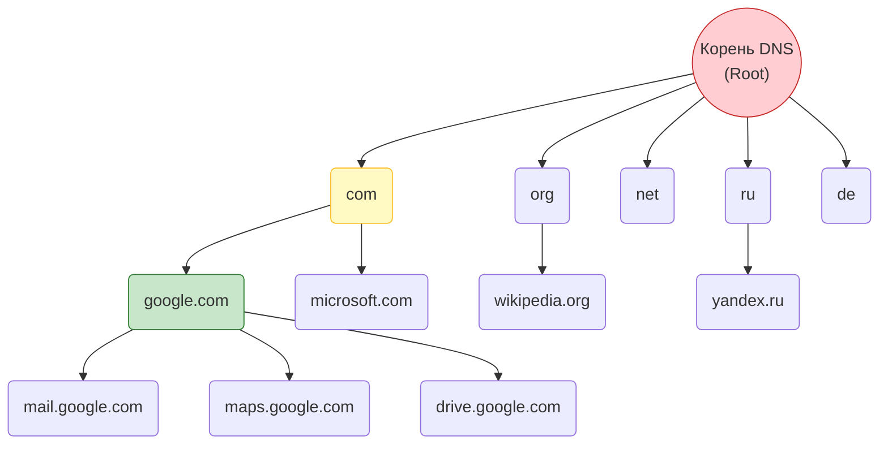
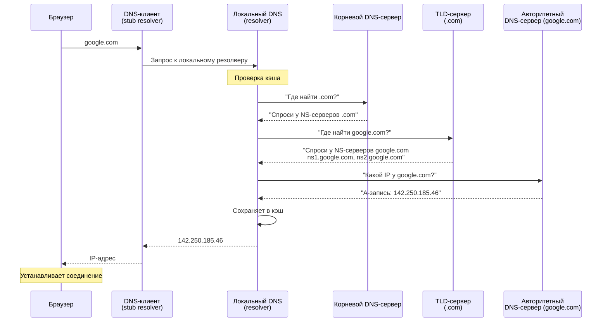
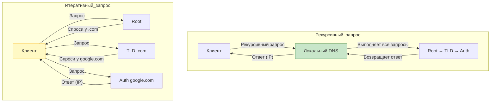
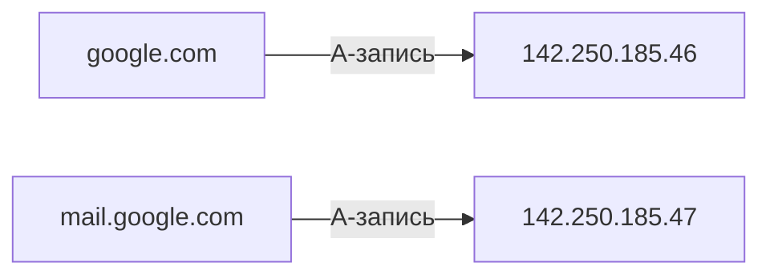
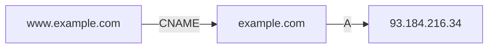
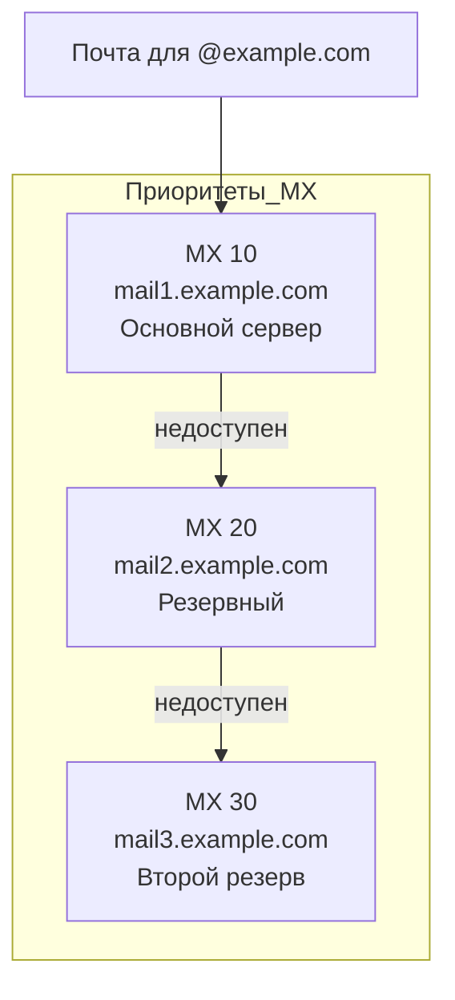
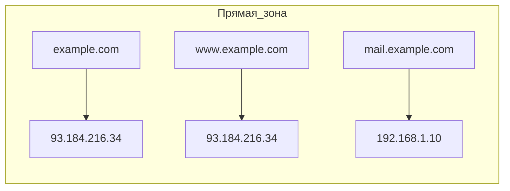
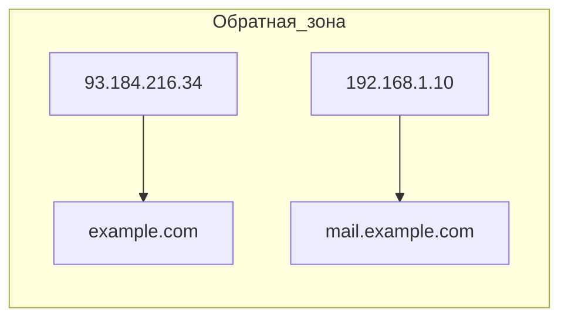
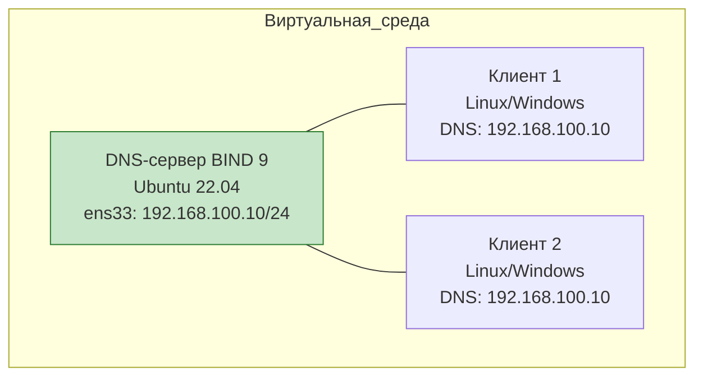

# Полный разбор работы DNS-сервера

## Введение: Зачем нужен DNS?

Представьте, что вам нужно позвонить другу. Вы не запоминаете его номер телефона (89261234567), вы помните его имя ("Антон"). Телефонная книга делает преобразование: "Антон" → номер телефона.

**DNS (Domain Name System)** — это "телефонная книга" интернета. Он преобразует удобные для человека доменные имена (например, `google.com`) в IP-адреса (например, `142.250.185.46`), понятные компьютерам.

**Без DNS** нам пришлось бы запоминать IP-адреса всех сайтов: `93.184.216.34` вместо `example.com`.

---

## Часть 1. Принципы работы сервиса и протокола DNS

### 1.1 Иерархическая структура DNS

DNS имеет **деревовидную иерархическую структуру**, похожую на файловую систему:



### 1.2 Полное доменное имя (FQDN)

**FQDN (Fully Qualified Domain Name)** — это полное имя, включающее все уровни иерархии:

```
mail.google.com.
│   │     │   │
│   │     │   └── корневой домен (обычно опускается)
│   │     └────── домен верхнего уровня (TLD)
│   └──────────── домен второго уровня (SLD)
└──────────────── поддомен (subdomain)
```

**Примеры:**
- `www.google.com.` — полное имя с точкой в конце
- `mail.yandex.ru.` — российский домен
- `api.github.com.` — поддомен API

### 1.3 Процесс DNS-резолвинга

Когда вы вводите в браузере `google.com`, происходит сложный процесс:



### 1.4 Рекурсивный и итеративный запросы



**Ключевые понятия:**
- **Рекурсивный резолвер** (обычно ISP или локальный) — выполняет полный поиск за клиента
- **Авторитетный сервер** — хранит официальные записи для своей зоны
- **Итеративный запрос** — сервер возвращает следующий шаг, а не конечный ответ

### 1.5 Типы DNS-серверов

```mermaid
graph LR
    subgraph Типы_DNS_серверов
        CACHE[Кэширующий резолвер<br/>Кэширует ответы<br/>Ускоряет повторные запросы]
        AUTH[Авторитетный сервер<br/>Хранит записи зоны<br/>Отвечает за свой домен]
        FORWARD[Пересылающий сервер<br/>Передает запросы выше<br/>Упрощает конфигурацию]
        MASTER[Мастер (Primary)<br/>Главная копия зоны<br/>Может редактироваться]
        SLAVE[Слейв (Secondary)<br/>Реплика мастера<br/>Только для чтения]
    end
```

---

## Часть 2. Виды записей DNS

### 2.1 Основные типы DNS-записей

| Тип | Назначение | Пример | Формат |
|-----|------------|--------|--------|
| **A** | IPv4-адрес | `example.com. 3600 IN A 93.184.216.34` | Домен → IPv4 |
| **AAAA** | IPv6-адрес | `example.com. 3600 IN AAAA 2606:2800:220:1:248:1893:25c8:1946` | Домен → IPv6 |
| **CNAME** | Каноническое имя (алиас) | `www.example.com. 3600 IN CNAME example.com.` | Псевдоним → реальное имя |
| **MX** | Почтовый обменник | `example.com. 3600 IN MX 10 mail.example.com.` | Домен → почтовый сервер (с приоритетом) |
| **NS** | Сервер имен | `example.com. 3600 IN NS ns1.example.com.` | Делегирование зоны |
| **TXT** | Текстовая информация | `example.com. 3600 IN TXT "v=spf1 mx ~all"` | Разное (SPF, DKIM, верификация) |
| **PTR** | Обратная запись | `34.216.184.93.in-addr.arpa. 3600 IN PTR example.com.` | IP → домен |
| **SOA** | Начало авторитетности | `example.com. 3600 IN SOA ns1.example.com. admin.example.com. ...` | Параметры зоны |
| **SRV** | Сервисная запись | `_sip._tcp.example.com. 3600 IN SRV 10 60 5060 sipserver.example.com.` | Сервис → порт/сервер |

### 2.2 Детальный разбор каждой записи

#### A-запись (Address Record)



**Использование:** Самая распространенная запись. Связывает домен с IPv4-адресом.

```bind
# Формат: домен TTL класс тип IPv4
google.com.    300 IN A 142.250.185.46
www.google.com. 300 IN A 142.250.185.46
```

#### CNAME-запись (Canonical Name)



**Важное правило:** CNAME нельзя использовать с другими записями для того же имени!

```bind
# Правильно
www.example.com. 3600 IN CNAME example.com.
example.com.     3600 IN A 93.184.216.34

# НЕПРАВИЛЬНО (не будет работать)
example.com.     3600 IN CNAME server.example.com.
example.com.     3600 IN MX 10 mail.example.com.  # Ошибка!
```

#### MX-запись (Mail Exchange)



**Формат:** `[приоритет] [почтовый сервер]`
- **Приоритет:** чем меньше число, тем выше приоритет (10 > 20)
- Почта всегда отправляется на сервер с наименьшим приоритетом

```bind
example.com. 3600 IN MX 10 mail1.example.com.
example.com. 3600 IN MX 20 mail2.example.com.
```

#### TXT-запись (Text)

Используется для различных текстовых данных, чаще всего для верификации и безопасности:

```bind
# SPF (Sender Policy Framework) — защита от подделки почты
example.com. 3600 IN TXT "v=spf1 mx ip4:192.168.1.0/24 ~all"

# DKIM (DomainKeys Identified Mail) — подпись писем
default._domainkey.example.com. 3600 IN TXT "v=DKIM1; k=rsa; p=MIGfMA0..."

# DMARC (Domain-based Message Authentication)
_dmarc.example.com. 3600 IN TXT "v=DMARC1; p=quarantine; rua=mailto:dmarc@example.com"

# Верификация домена для Google, Microsoft и др.
google-site-verification=abc123def456
```

#### SRV-запись (Service)

Определяет местоположение сервисов (не только почты):

```bind
# Формат: _service._protocol.domain. TTL IN SRV priority weight port target
_sip._tcp.example.com. 3600 IN SRV 10 60 5060 sipserver.example.com.
```

**Параметры:**
- **priority:** приоритет (меньше = выше)
- **weight:** вес для балансировки среди одинаковых приоритетов
- **port:** порт сервиса
- **target:** целевой сервер

---

## Часть 3. Зоны прямого и обратного преобразования

### 3.1 Зона прямого преобразования (Forward Zone)

Преобразует **имя → IP**:



**Файл прямой зоны (`db.example.com`):**

```bind
$TTL 3600
@       IN  SOA ns1.example.com. admin.example.com. (
            2024032401  ; Serial (YYYYMMDDNN)
            3600        ; Refresh
            1800        ; Retry
            604800      ; Expire
            86400       ; Minimum TTL
        )

; NS-записи
        IN  NS  ns1.example.com.
        IN  NS  ns2.example.com.

; A-записи (прямое преобразование)
ns1     IN  A   192.168.1.1
ns2     IN  A   192.168.1.2
@       IN  A   93.184.216.34
www     IN  A   93.184.216.34
mail    IN  A   192.168.1.10

; MX-запись
        IN  MX  10 mail
```

### 3.2 Зона обратного преобразования (Reverse Zone)

Преобразует **IP → имя**. Необходима для:
- Проверки подлинности почтовых серверов
- Диагностики (traceroute, nslookup)
- Безопасности (обратные lookup-ы)



**Файл обратной зоны (`db.192.168.1`):**

```bind
$TTL 3600
@       IN  SOA ns1.example.com. admin.example.com. (
            2024032401  ; Serial
            3600        ; Refresh
            1800        ; Retry
            604800      ; Expire
            86400       ; Minimum TTL
        )

        IN  NS  ns1.example.com.
        IN  NS  ns2.example.com.

; PTR-записи (обратное преобразование)
1       IN  PTR ns1.example.com.
2       IN  PTR ns2.example.com.
10      IN  PTR mail.example.com.
```

**Особенность:** Для обратной зоны используется специальное доменное имя:
- IPv4: `1.168.192.in-addr.arpa` (адрес пишется задом наперед)
- IPv6: `0.0.0.0.0.0.0.0.0.0.0.0.0.0.0.0.1.0.0.0.8.b.d.0.1.0.0.2.ip6.arpa`

### 3.3 Структура SOA-записи

**SOA (Start of Authority)** — самая важная запись в зоне:

```bind
example.com. 3600 IN SOA ns1.example.com. admin.example.com. (
            2024032401  ; Serial number (серийный номер)
            3600        ; Refresh (обновление для слейвов)
            1800        ; Retry (повтор при ошибке)
            604800      ; Expire (время жизни зоны)
            86400       ; Minimum TTL (минимальный TTL)
        )
```

| Поле | Назначение | Рекомендация |
|------|------------|--------------|
| **Serial** | Версия зоны. Увеличивать при каждом изменении | Формат: ГГГГММДДНН (2024032401) |
| **Refresh** | Как часто слейв проверяет обновления | 3600 (1 час) |
| **Retry** | Интервал повтора при ошибке | 1800 (30 мин) |
| **Expire** | Через сколько слейв перестает отвечать | 604800 (7 дней) |
| **Minimum TTL** | TTL по умолчанию для негативных ответов | 86400 (24 часа) |

---

## Часть 4. Лабораторная работа: BIND 9

### 4.1 Лабораторная среда

**Цель:** Установить, настроить и проверить работу DNS-сервера BIND 9.

**Схема лабораторной работы:**



### 4.2 Установка BIND 9

#### Шаг 1: Установка пакетов

```bash
# Обновляем систему
sudo apt update && sudo apt upgrade -y

# Устанавливаем BIND 9
sudo apt install bind9 bind9utils bind9-doc dnsutils -y

# Проверяем установку
named -v
# BIND 9.18.28-0ubuntu0.22.04.1-Ubuntu (Extended Support Version)
```

#### Шаг 2: Структура файлов BIND

```bash
# Основные каталоги
/etc/bind/              # Конфигурационные файлы
├── named.conf          # Основной конфигурационный файл
├── named.conf.options  # Глобальные настройки
├── named.conf.local    # Локальные зоны (для добавления зон)
├── named.conf.default-zones # Зоны по умолчанию
├── db.local            # Пример файла зоны localhost
├── db.127              # Обратная зона localhost
├── db.empty            # Пустая зона
└── zones/              # Каталог для пользовательских зон (создаем сами)

/var/cache/bind/        # Кэш и динамические зоны
/var/log/bind/          # Логи (создаем сами)
```

### 4.3 Базовая настройка BIND

#### Шаг 3: Настройка глобальных опций

```bash
sudo nano /etc/bind/named.conf.options
```

```bind
options {
    # Слушаем на всех интерфейсах
    listen-on port 53 { any; };
    listen-on-v6 port 53 { any; };
    
    # Разрешаем запросы из локальной сети
    allow-query { any; };
    
    # Разрешаем рекурсивные запросы (только для локальной сети)
    recursion yes;
    allow-recursion { 127.0.0.1; 192.168.100.0/24; };
    
    # Пересылка запросов к внешним DNS (для резолвинга)
    forwarders {
        8.8.8.8;
        8.8.4.4;
        1.1.1.1;
    };
    
    # Оптимизация
    dnssec-validation auto;
    auth-nxdomain no;
    
    # Каталог для зон
    directory "/var/cache/bind";
    
    # Логирование
    querylog yes;
    
    # Версия сервера (скрываем для безопасности)
    version "DNS Server";
};
```

#### Шаг 4: Создание прямой зоны

```bash
sudo nano /etc/bind/named.conf.local
```

Добавляем зону:

```bind
// Прямая зона example.lab
zone "example.lab" {
    type master;
    file "/etc/bind/zones/db.example.lab";
    allow-transfer { 192.168.100.0/24; };
    allow-update { none; };
};
```

#### Шаг 5: Создание файла зоны

```bash
# Создаем каталог для зон
sudo mkdir -p /etc/bind/zones

# Создаем файл зоны
sudo nano /etc/bind/zones/db.example.lab
```

```bind
$TTL 3600
@       IN  SOA ns1.example.lab. admin.example.lab. (
            2024032401  ; Serial
            3600        ; Refresh
            1800        ; Retry
            604800      ; Expire
            86400       ; Minimum TTL
        )

; NS-записи
        IN  NS  ns1.example.lab.
        IN  NS  ns2.example.lab.

; A-записи (серверы имен)
ns1     IN  A   192.168.100.10
ns2     IN  A   192.168.100.11

; A-записи (хосты)
@       IN  A   192.168.100.10
www     IN  A   192.168.100.20
mail    IN  A   192.168.100.30
ftp     IN  A   192.168.100.40

; CNAME-записи
web     IN  CNAME www
server  IN  CNAME ns1

; MX-запись
        IN  MX  10 mail.example.lab.

; TXT-запись (SPF)
        IN  TXT "v=spf1 mx -all"
```

#### Шаг 6: Создание обратной зоны

Добавляем в `/etc/bind/named.conf.local`:

```bind
// Обратная зона для подсети 192.168.100.0/24
zone "100.168.192.in-addr.arpa" {
    type master;
    file "/etc/bind/zones/db.192.168.100";
    allow-transfer { 192.168.100.0/24; };
};
```

Создаем файл `/etc/bind/zones/db.192.168.100`:

```bind
$TTL 3600
@       IN  SOA ns1.example.lab. admin.example.lab. (
            2024032401  ; Serial
            3600        ; Refresh
            1800        ; Retry
            604800      ; Expire
            86400       ; Minimum TTL
        )

        IN  NS  ns1.example.lab.
        IN  NS  ns2.example.lab.

; PTR-записи (IP → имя)
10      IN  PTR ns1.example.lab.
11      IN  PTR ns2.example.lab.
20      IN  PTR www.example.lab.
30      IN  PTR mail.example.lab.
40      IN  PTR ftp.example.lab.
```

### 4.4 Проверка конфигурации и запуск

#### Шаг 7: Проверка синтаксиса

```bash
# Проверяем основной конфиг
sudo named-checkconf

# Проверяем прямую зону
sudo named-checkzone example.lab /etc/bind/zones/db.example.lab

# Ожидаемый вывод:
# zone example.lab/IN: loaded serial 2024032401
# OK

# Проверяем обратную зону
sudo named-checkzone 100.168.192.in-addr.arpa /etc/bind/zones/db.192.168.100

# Ожидаемый вывод:
# zone 100.168.192.in-addr.arpa/IN: loaded serial 2024032401
# OK
```

#### Шаг 8: Запуск службы

```bash
# Перезапускаем BIND
sudo systemctl restart bind9

# Включаем автозапуск
sudo systemctl enable bind9

# Проверяем статус
sudo systemctl status bind9

# Проверяем, слушает ли сервер порт 53
sudo netstat -tulpn | grep :53
# Должны увидеть:
# udp        0      0 0.0.0.0:53              0.0.0.0:*                           1234/named
# tcp        0      0 0.0.0.0:53              0.0.0.0:*                           1234/named
```

### 4.5 Настройка клиента

#### Linux-клиент

```bash
# Временная настройка DNS
sudo echo "nameserver 192.168.100.10" > /etc/resolv.conf

# Или через netplan (Ubuntu 22.04)
sudo nano /etc/netplan/00-installer-config.yaml
```

```yaml
network:
  ethernets:
    ens33:
      dhcp4: no
      addresses:
        - 192.168.100.50/24
      nameservers:
        addresses: [192.168.100.10]
      routes:
        - to: default
          via: 192.168.100.1
  version: 2
```

```bash
sudo netplan apply
```

#### Windows-клиент

```cmd
# В командной строке (администратор)
netsh interface ip set dns "Ethernet" static 192.168.100.10

# Или через GUI:
# Панель управления → Сеть и интернет → Центр управления сетями
# → Изменение параметров адаптера → Свойства → Протокол IP версии 4
```

### 4.6 Проверка работы DNS

#### Шаг 9: Базовые запросы

```bash
# Прямые A-записи
dig @192.168.100.10 www.example.lab

# Ожидаемый ответ:
# ;; ANSWER SECTION:
# www.example.lab.    3600    IN  A   192.168.100.20

# Обратные PTR-записи
dig @192.168.100.10 -x 192.168.100.30

# MX-записи
dig @192.168.100.10 example.lab MX

# NS-записи
dig @192.168.100.10 example.lab NS

# CNAME
dig @192.168.100.10 web.example.lab

# TXT-записи
dig @192.168.100.10 example.lab TXT
```

#### Шаг 10: Использование nslookup

```bash
# Интерактивный режим
nslookup
> server 192.168.100.10
> set type=A
> www.example.lab
> set type=MX
> example.lab
> set type=PTR
> 192.168.100.30
> exit

# Прямой запрос
nslookup www.example.lab 192.168.100.10

# Обратный запрос
nslookup 192.168.100.30 192.168.100.10
```

### 4.7 Мониторинг и логирование

#### Настройка логирования

```bash
sudo nano /etc/bind/named.conf.local
```

Добавляем в конец:

```bind
logging {
    channel query_log {
        file "/var/log/bind/query.log" versions 3 size 10M;
        severity info;
        print-time yes;
        print-category yes;
        print-severity yes;
    };
    
    category queries { query_log; };
    category default { default_syslog; };
};
```

```bash
# Создаем каталог для логов
sudo mkdir -p /var/log/bind
sudo chown bind:bind /var/log/bind

# Перезапускаем BIND
sudo systemctl restart bind9

# Смотрим логи запросов
sudo tail -f /var/log/bind/query.log

# Пример вывода:
# 24-Mar-2024 10:15:30.123 queries: info: client @0x7f1234 192.168.100.50#54321 (www.example.lab): query: www.example.lab IN A +E(0)K (192.168.100.10)
```

#### Команды мониторинга

```bash
# Статистика DNS-сервера
sudo rndc stats
sudo cat /var/cache/bind/named.stats

# Очистка кэша
sudo rndc flush

# Просмотр статуса
sudo rndc status

# Перезагрузка конфигурации без остановки
sudo rndc reload

# Просмотр активных зон
sudo rndc zonestatus

# Запрос статистики по зоне
sudo rndc dumpdb -all
```

### 4.8 Практические задания для лабораторной

**Задание 1: Базовая настройка**
1. Установите BIND 9 на Ubuntu 22.04
2. Настройте прямую зону для домена `lab.local` с вашими именами
3. Настройте обратную зону для подсети 192.168.100.0/24
4. Проверьте работу через `dig` и `nslookup`

**Задание 2: Различные типы записей**
1. Добавьте в зону:
   - A-запись для `db.lab.local` с IP 192.168.100.60
   - CNAME `database` → `db.lab.local`
   - MX-запись с приоритетом 10 для `mail.lab.local`
   - TXT-запись с SPF-политикой
2. Проверьте каждый тип записи

**Задание 3: Master-Slave репликация**
1. Настройте второй сервер DNS (slave) на другой VM
2. Настройте передачу зоны между серверами
3. Проверьте, что изменения на мастере автоматически передаются на слейв

**Задание 4: Мониторинг**
1. Настройте подробное логирование запросов
2. Сделайте несколько запросов с клиента
3. Проанализируйте логи

---

